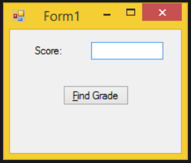


# Generic List Exercise
Generic List Exercise  

# Assignment 1
  
ArrayLists and Structures
  
Code a form that allows Professor Carver to display a grade
based on the number of points she enters. 

The grading scale is as follows:
 
<pre>
| Minimum points 	| Maximum points 	| Grade 	|
|----------------	|----------------	|-------	|
| 0              	| 299            	| F     	|
| 300            	| 349            	| D     	|
| 350            	| 399            	| C     	|
| 400            	| 449            	| B     	|
| 450            	| 500            	| A     	|
</pre>
  
Load an arraylist of structures. Each structure should contain only the maximum points and
the grade